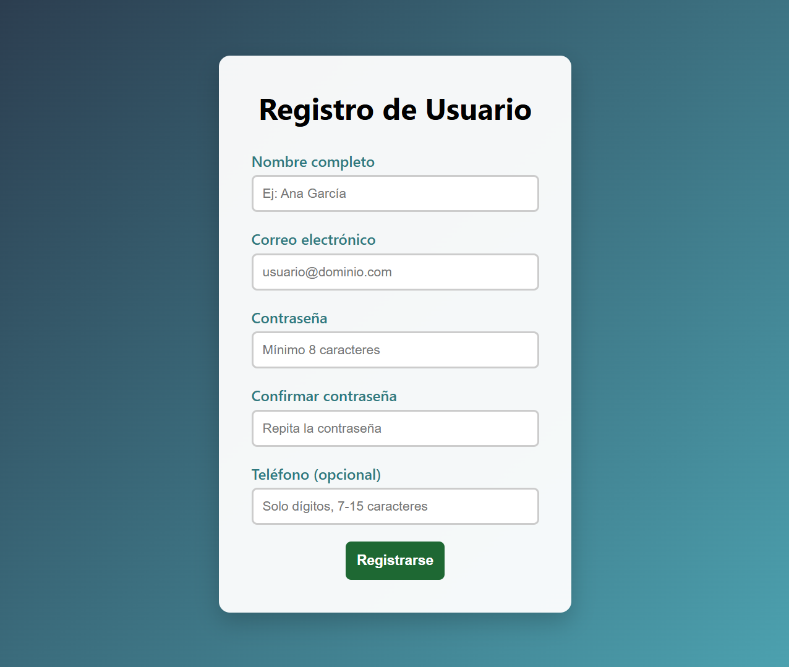
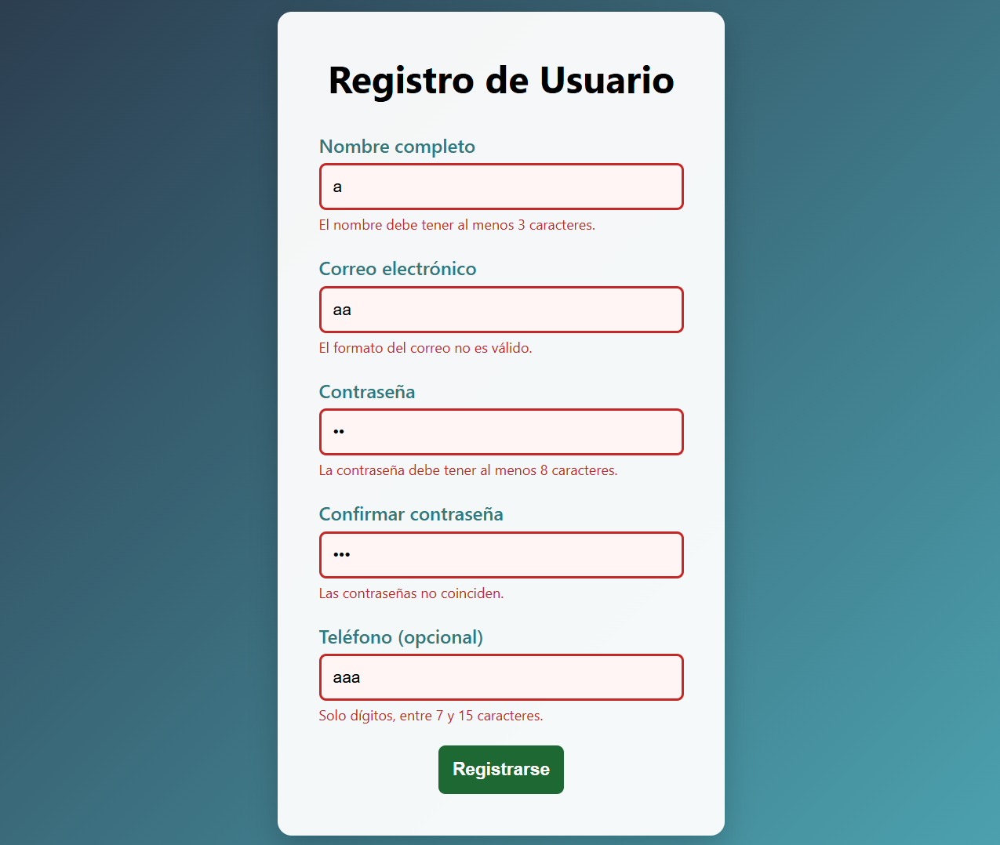
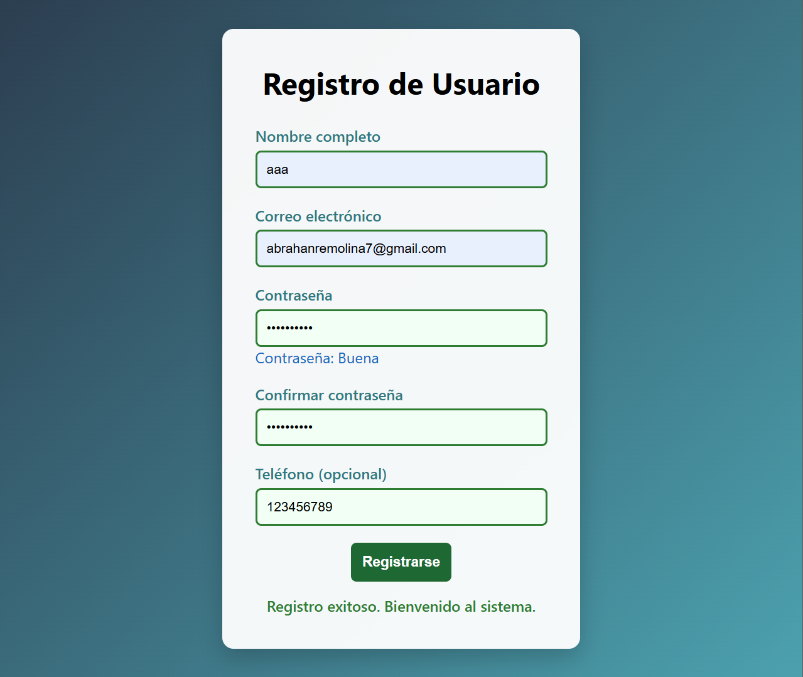

# Registro de Usuario - Validación con JavaScript

**Nombre:** Abrahan Remolina Bolívar  
**Código:** 02230131004  

## Descripción

Este proyecto consiste en el desarrollo de un formulario de registro con validaciones del lado del cliente utilizando JavaScript. Se hace uso de la Constraint Validation API junto con manipulación del DOM para controlar el comportamiento del formulario.

El sistema valida los siguientes campos:

- Nombre completo  
- Correo electrónico  
- Contraseña  
- Confirmación de contraseña  
- Teléfono (opcional)  

Además, se implementa retroalimentación visual para el usuario y validación en tiempo real en cada campo.

## Tecnologías utilizadas

- HTML5  
- CSS3  
- JavaScript (ES6)  
- DOM  
- Constraint Validation API  

## Ejecución del proyecto

1. Clonar o descargar el repositorio.  
2. Abrir la carpeta en Visual Studio Code.  
3. Ejecutar el archivo con la extensión Live Server.  

## Funcionalidades

- Validación en tiempo real mediante eventos `blur`  
- Verificación del formato del correo electrónico  
- Evaluación de la seguridad de la contraseña  
- Confirmación de coincidencia de contraseña  
- Mensajes de error personalizados  
- Notificación de registro exitoso  

## Capturas

### Formulario

### Validación de errores

### Registro exitoso

